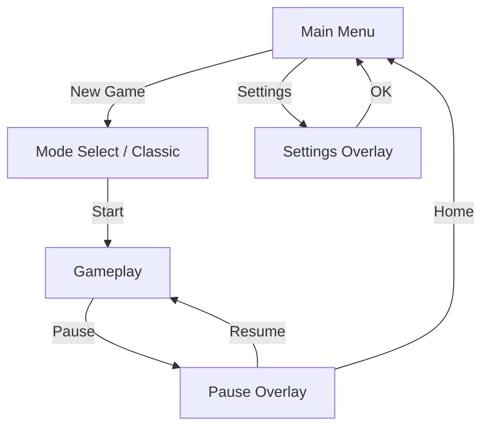

# ARXON Unity UI Handoff Template

Bu dokuman, Illustrator artboard preview'lerinden ve `arxon_ui.png` atlasindan Unity UI kurulumu yapmak icin doldurulabilir handoff sablonudur.

## 1. Handoff Ozeti

| Alan | Deger |
| --- | --- |
| Handoff tarihi | |
| Hazirlayan | |
| Unity surumu | |
| Hedef platform | iOS / Android / ikisi |
| Hedef orientation | Portrait |
| Referans cozunurluk | `1080 x 1920` |
| Tablet destegi | Evet / Hayir / Sonra |
| Safe area destegi | Evet |
| Atlas dosyasi | `arxon_ui.png` |
| Artboard preview klasoru | |
| Font dosyalari | |
| Lokalizasyon sistemi | |
| Notlar | |

## 2. Kaynak Dosyalar

### 2.1 Illustrator Kaynaklari

| Dosya | Amac | Son surum | Not |
| --- | --- | --- | --- |
| `...ai` | Ana UI layout | | |
| `...png` | Artboard preview export | | |
| `arxon_ui.png` | UI atlas | | |

### 2.2 Unity'ye Verilecek Dosyalar

| Dosya / Klasor | Zorunlu | Aciklama |
| --- | --- | --- |
| Artboard preview PNG'leri | Evet | Ekran bazli referans |
| `arxon_ui.png` | Evet | Slice edilecek atlas |
| Font dosyalari (`.ttf` / `.otf`) | Evet | TMP icin |
| UI ikonlari ayri export ise | Opsiyonel | Tekil test / override icin |
| Lokalizasyon key listesi | Evet | Buton ve baslik metinleri |
| UI davranis notlari | Evet | State, glow, navigation vb. |

## 3. Ekran Envanteri

Asagidaki tabloyu her ekran icin doldur.

| Ekran ID | Artboard adi | Unity scene/panel | Durum | Not |
| --- | --- | --- | --- | --- |
| `main_menu` | `01 - main menu` | | Draft / Ready | |
| `classic_mode` | `02 - classic mode` | | Draft / Ready | |
| `adventure_mode` | `03 - adventure mode` | | Draft / Ready | |
| `pause` | `04 - pause screen` | | Draft / Ready | |
| `settings` | `05 - settings screen` | | Draft / Ready | |

## 4. Asset Export Kurallari

### 4.1 Genel Export Kurallari

- Tum text katmanlari PNG'ye gomulmeyecek.
- `OK` butonu istisna ise burada belirtilmeli:
  - PNG icinde kalacak mi:
  - Sonradan TMP'ye tasinacak mi:
- Arka plan, panel, buton, ikon ve dekor katmanlari ayri dusunulmeli.
- Efektler mumkunse Unity tarafinda verilecek:
  - glow
  - highlight
  - pressed hissi
  - selected state
- Alpha kenarlarinda kirilma olmamasi icin export sirasinda yeterli padding birakilmali.

### 4.2 Export Listesi

| Asset adi | Tip | Ayrik export gerekli mi | Atlas'ta var mi | Not |
| --- | --- | --- | --- | --- |
| Main background | Background | Evet / Hayir | | |
| Stone panel | Panel | Evet / Hayir | | |
| Primary button body | Button | Evet / Hayir | | |
| Secondary button body | Button | Evet / Hayir | | |
| Home icon | Icon | Evet / Hayir | | |
| Settings icons | Icon | Evet / Hayir | | |
| Mode tiles / blocks | Interactive | Evet / Hayir | | |
| Decorative foliage / frame | Decor | Evet / Hayir | | |

### 4.3 Import Ayarlari Notu

Unity import varsayimlari:

- Texture Type: `Sprite (2D and UI)`
- Sprite Mode: `Multiple` (`arxon_ui.png` icin)
- Mesh Type: `Full Rect`
- Compression: UI okunurlugunu bozmayacak sekilde
- Generate Mip Maps: `Off`
- Filter Mode: proje stiline gore `Bilinear` veya `Point`
- Max Size: atlas boyutuna gore

## 5. Sprite Slicing Plani

### 5.1 Slice Tablosu

| Sprite adi | Kaynak | Slice tipi | Border | Pivot | Not |
| --- | --- | --- | --- | --- | --- |
| `btn_primary` | `arxon_ui.png` | Single | `L/T/R/B:` | Center | 9-slice |
| `btn_secondary` | `arxon_ui.png` | Single | `L/T/R/B:` | Center | 9-slice |
| `panel_stone_large` | `arxon_ui.png` | Single | `L/T/R/B:` | Center | 9-slice |
| `panel_mode_header` | `arxon_ui.png` | Single | `L/T/R/B:` | Center | 9-slice olabilir |
| `icon_home` | `arxon_ui.png` | Single | `0` | Center | |
| `icon_audio` | `arxon_ui.png` | Single | `0` | Center | |

### 5.2 9-Slice Karar Rehberi

9-slice kullan:

- farkli uzunluklarda buton olacaksa
- panel yuksekligi / genisligi degisecekse
- lokalizasyon nedeniyle text alanlari buyuyebilecekse

Tek parca sprite kullan:

- sabit boyutlu ikonlarda
- dekoratif detaylarda
- esnetilince bozulacak ozel cizimlerde

## 6. Canvas Kurulum Kararlari

### 6.1 Global Canvas Ayarlari

| Ayar | Deger |
| --- | --- |
| Render Mode | `Screen Space - Overlay` veya `Screen Space - Camera` |
| UI Scale Mode | `Scale With Screen Size` |
| Reference Resolution | `1080 x 1920` |
| Screen Match Mode | `Match Width Or Height` |
| Match | `0.5` ile basla, gerekirse ekran bazli ayarla |
| Pixel Perfect | Gerekiyorsa |

### 6.2 Safe Area Yaklasimi

| Alan | Karar |
| --- | --- |
| Top notch korumasi | |
| Bottom home indicator korumasi | |
| Safe area script'i | Kullan / Kullanma |
| Safe area hangi root'a uygulanacak | |

Onerilen kurulum:

- `Canvas`
  - `SafeAreaRoot`
    - tum ust UI
    - tum alt UI
- full-screen background safe area disina tasabilir
- kritik butonlar ve text bloklari `SafeAreaRoot` icinde kalir

## 7. Canvas Hierarchy Template

Asagidaki yapiyi ekran veya prefab bazinda uyarlayabilirsin.

```text
Canvas
|- SafeAreaRoot
|  |- ScreenRoot_MainMenu
|  |  |- Background
|  |  |- Logo
|  |  |- CenterPanel
|  |  |  |- Btn_NewGame
|  |  |  |  |- Label_TMP
|  |  |  |- Btn_Resume
|  |  |  |  |- Label_TMP
|  |  |  |- Btn_Settings
|  |  |  |  |- Label_TMP
|  |  |- TopLeft_MenuButton
|  |
|  |- ScreenRoot_ClassicMode
|  |- ScreenRoot_AdventureMode
|  |- Overlay_Pause
|  |- Overlay_Settings
|  |- PopupRoot
|  |- FXRoot
|- EventSystem
```

### 7.1 Prefab Adaylari

| Prefab adi | AmaC | Tekrar kullanilacak mi |
| --- | --- | --- |
| `UIPrimaryButton` | Ana yesil buton | Evet |
| `UISecondaryButton` | Ikincil buton | Evet |
| `UIStonePanel` | Orta panel | Evet |
| `UIToggleRow` | Ayarlar satiri | Evet |
| `UIModeTile` | Mode secim karti / blok | Evet |
| `UIScreenHeader` | Ust dekoratif baslik alani | Evet |

## 8. Anchors ve Layout Kararlari

### 8.1 Ekran Bazli Anchor Notlari

| Eleman | Anchor | Pivot | Layout notu |
| --- | --- | --- | --- |
| Arka plan | Stretch full | Center | Aspect fill mantigi |
| Logo | Top center | 0.5 / 0.5 | Safe area icinde |
| Ana panel | Middle center | 0.5 / 0.5 | Sabit max width |
| Menu button | Top left | 0.5 / 0.5 | Safe area'ya bagli |
| Footer action | Bottom center | 0.5 / 0.5 | Home indicator'dan uzak |
| Settings list | Center stretch | 0.5 / 0.5 | Dikey layout olabilir |

### 8.2 Responsive Notlar

- Dikey cihazlar ilk hedef.
- Dar ekranlarda once bosluklar kisilsin, sonra text auto-size devreye girsin.
- Tablet icin ilk asamada ozel layout yoksa:
  - merkez panel buyume siniri olmali
  - asiri genisleyen butonlardan kacin
  - dekoratif background yanlarda daha fazla gorunebilir

## 9. TMP Text Handoff

### 9.1 Font ve Stil Tablosu

| Stil ID | Font Asset | Boyut | Weight | Renk | Outline / Shadow | Kullanim |
| --- | --- | --- | --- | --- | --- | --- |
| `ui_button_primary` | | | | | | Ana buton |
| `ui_button_secondary` | | | | | | Ikincil buton |
| `ui_heading` | | | | | | Baslik |
| `ui_label_small` | | | | | | Ayar etiketi |
| `ui_popup_action` | | | | | | Popup aksiyon |

### 9.2 Lokalizasyon ve Text Davranisi

| Key | Varsayilan TR | Max satir | Auto-size | Alignment | Not |
| --- | --- | --- | --- | --- | --- |
| `main_menu.new_game` | Yeni Oyun | 1 | Evet / Hayir | Center | |
| `main_menu.resume` | Devam Et | 1 | Evet / Hayir | Center | |
| `main_menu.settings` | Ayarlar | 1 | Evet / Hayir | Center | |
| `pause.resume` | Devam Et | 1 | Evet / Hayir | Center | |
| `settings.ok` | OK | 1 | Evet / Hayir | Center | PNG ise not dus |

### 9.3 TMP Kurallari

- Lokalize olacak hicbir text PNG icinde olmamali.
- TMP text container'lari lokalizasyonu tasiyacak kadar guvenli padding ile kurulmalı.
- Buton text'lerinde:
  - tek satir tercih edilecek mi:
  - auto-size izinli mi:
  - minimum size kac:
- Turkce karakterler dogrulandi mi:
  - `C, G, I, I, O, S, U` varyasyonlari
  - `c, g, i, o, s, u`

## 10. Button States ve Interaction Behavior

### 10.1 State Kararlari

State'ler PNG yerine Unity tarafinda verilecek.

| State | Gorsel davranis | Teknik uygulama | Not |
| --- | --- | --- | --- |
| `normal` | Baz gorunum | Default sprite | |
| `highlighted` | Hafif glow / parlaklik artisi | Ek glow image / color tween | |
| `pressed` | Hafif scale down + glow azalmasi | Tween / animation | |
| `selected` | Belirgin rim light veya ic parlama | Ayrik selected overlay | Mode/block seciminde |
| `disabled` | Soluk / dusuk saturation | Material / color change | |

### 10.2 Efekt Notlari

- Glow sprite ayri katman olarak dusunulecek mi:
- Press suresi:
- Bounce kullanilacak mi:
- Ses / haptic baglanacak mi:
- Mode tile ve standart button state farki olacak mi:

### 10.3 Teknik Tercih

| Bilesen | Tercih |
| --- | --- |
| Buton gecis sistemi | `Button transition`, tween script, animator |
| Glow kontrolu | Ayrik `Image`, shader veya material |
| Scale animasyonu | Script / tween |
| Selected state kaliciligi | Evet / Hayir |

## 11. Navigation Flow

### 11.1 Akis Tablosu

| Kaynak ekran | Etkilesim | Hedef ekran | Gecis tipi | Not |
| --- | --- | --- | --- | --- |
| `main_menu` | `New Game` | `mode_select` veya `classic_mode` | Screen switch | |
| `main_menu` | `Resume` | Son oyun / ilgili ekran | Screen switch | |
| `main_menu` | `Settings` | `settings` | Popup / overlay | |
| `classic_mode` | `Back/Menu` | `main_menu` | Screen switch | |
| `adventure_mode` | `Back/Menu` | `main_menu` | Screen switch | |
| `gameplay` | `Pause` | `pause` | Overlay | |
| `pause` | `Resume` | `gameplay` | Overlay close | |
| `pause` | `Home` | `main_menu` | Scene switch | |
| `settings` | `OK` | onceki ekran | Overlay close | |

### 11.2 Basit Akis Diyagrami



## 12. Ekran Bazli Uygulama Notlari

Bu bolumu her ekran icin ayri kopyala.

### 12.X Screen: `[screen_id]`

| Alan | Deger |
| --- | --- |
| Artboard adi | |
| Unity hedefi | Scene / Panel / Popup |
| Arka plan asset'i | |
| Ana panel asset'i | |
| Kullanilan buton prefab'lari | |
| Kullanilan ikonlar | |
| Lokalizasyon key'leri | |
| Ozel state davranisi | |
| Safe area riskleri | |
| Notlar | |

## 13. Teslim Kontrol Listesi

### 13.1 Tasarim Tarafi

- Artboard preview'leri guncel
- `arxon_ui.png` guncel
- Slice edilmesi gereken UI parcalari isaretli
- Lokalize olacak text'ler listelendi
- Font dosyalari teslim edildi
- Buton state mantigi netlesti
- Ekran akis notlari hazir

### 13.2 Unity Tarafi

- Atlas import ayarlari dogrulandi
- Sprite slicing tamamlandi
- Canvas scaler ayarlandi
- Safe area root kuruldu
- TMP font asset'leri hazir
- Ana prefab'lar olusturuldu
- Navigation baglantilari yapildi
- En az 2 farkli ekran oraninda gorunus kontrol edildi

## 14. Acik Sorular

| Konu | Soru | Cevap / Karar |
| --- | --- | --- |
| Tablet | Ozel layout gerekiyor mu? | |
| `OK` butonu | PNG olarak mi kalacak? | |
| Settings toggles | Gercek toggle mi, buton mu? | |
| Pause screen | Ayrı scene mi, overlay mi? | |
| Adventure / Classic | Ayri scene mi, tek scene icinde panel mi? | |
| UI effects | DOTween benzeri bir cozum kullanilacak mi? | |

## 15. Onerilen Varsayimlar

Karar verilmemisse asagidaki varsayimlarla baslanabilir:

- hedef cihaz: telefon
- orientation: portrait
- referans resolution: `1080 x 1920`
- safe area: aktif
- lokalizasyon: TMP ile dinamik
- buton state'leri: Unity tarafinda glow + scale tween
- panel ve buton govdeleri: 9-slice
- ikonlar: tek parca sprite
- ayarlar ve pause: overlay

